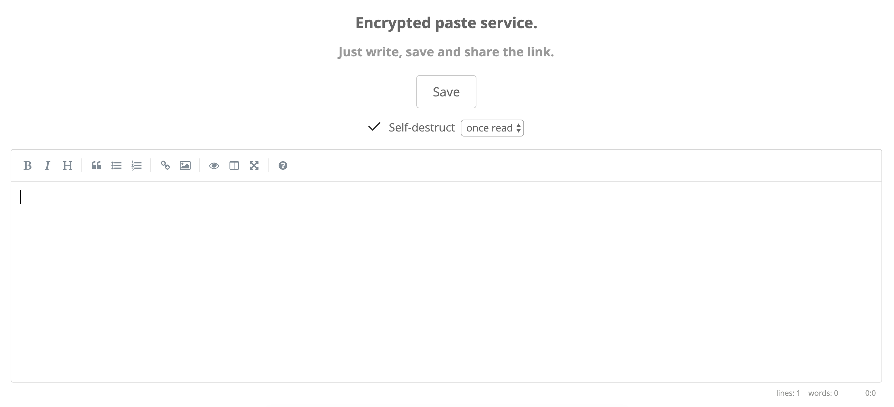

# Ctrl + V Space

Encrypted paste service. **Encryption (AES256 GCM using [Stanford Javascript Crypto Library](http://bitwiseshiftleft.github.io/sjcl/)) only happens on the client-side** and the **password is never sent to the server**.

The paste creation process:
- Save button triggers `save()` function in *index.html*.
- Validation checks, generate random password and encrypt text box content.
- If self-destruct 'once read' option is enabled, generate random token and encrypt with password.
- POST /api/v1/create with:
    - Encrypted text box content, if self-destruct is disabled.
    - Encrypted text box content + token & encrypted token, if self-destruct 'once read' option is enabled.
    - Encrypted text box content + self-destruct option (e.g. 1h), if self-destruct timing option is enabled.
- Backend saves things in Redis and returns a key. We now construct the sharing URL:
    - https://ctrlv.space/*key*#*password* where:
        - *key*: used to retrieve the encrypted content from the server.
        - *password*: used to decrypt the content. **Password is never sent to the server** as it resides after the # fragment.

The paste viewing process:
- We open the link and GET /*key*. Backend checks if *key* exists in DB (return 404 if not), pre-fill encrypted content in *paste.html* template. If encrypted token exists in DB for the *key* (self-destruct 'once read' option was enabled), pre-fill encrypted token as well.
- On the client-side, get the password from the # fragment in the URL.
- Decrypt encrypted content and encrypted token (if self-destruct 'once read' option was enabled) using the password.
- If successfully decrypted, show the content in the text box.
- If self-destruct 'once read' option was enabled and the token was decrypted successfully, POST /api/v1/destruct with the *key* and the decrypted token. Backend will delete the paste if the token matches the one generated by the creator. **Paste will not self-destruct if the password is wrong; it will only do so once someone has successfully decrypted and read the content.**

## Env vars

`REDIS_URL` - defaults to redis://localhost:6379 (if using dokku, will be automatically set when linking with Redis service) 
`SELF_DESTRUCT_MANDATORY` - defaults to false (If set, will disable the 'Self-destruct' checkbox so it's always ticked) 
`MAX_LENGTH` - defaults to 5000 (Maximum number of characters allowed in the text box) 
`GOOGLE_ANALYTICS_ID` - defaults to ""

## Run

Using Docker:
* Use an external Redis or host your own: `docker run --name redis -d redis`
* Run the app: `docker run -d --link redis:redis -p 80:5000 -e REDIS_URL="redis://redis:6379" ghcr.io/adrianchifor/ctrlv.space:latest`
  * If you're using an external Redis omit the `--link` and set the `REDIS_URL` accordingly.

Using [dokku](http://dokku.viewdocs.io/dokku/):
* Create `ctrlv` app on dokku
* Create a Redis service on dokku using this [plugin](https://github.com/dokku/dokku-redis) and link it with `ctrlv` (this will set the `REDIS_URL` env var)
* Set the rest of the env vars on dokku: `dokku config:set ctrlv <ENV>=<VALUE>`
* Set the dokku remote in the git repo:
`git remote add dokku dokku@example.com:ctrlv`
* Deploy:
`git push dokku master`

### License

Copyright &copy; 2020 Adrian Chifor

This program is free software: you can redistribute it and/or modify
it under the terms of the GNU General Public License as published by
the Free Software Foundation, either version 3 of the License, or
(at your option) any later version.

This program is distributed in the hope that it will be useful,
but WITHOUT ANY WARRANTY; without even the implied warranty of
MERCHANTABILITY or FITNESS FOR A PARTICULAR PURPOSE.  See the
GNU General Public License for more details.

You should have received a copy of the GNU General Public License
along with this program. If not, see <http://www.gnu.org/licenses/>.
